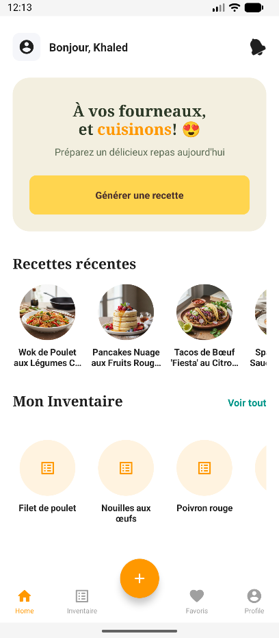
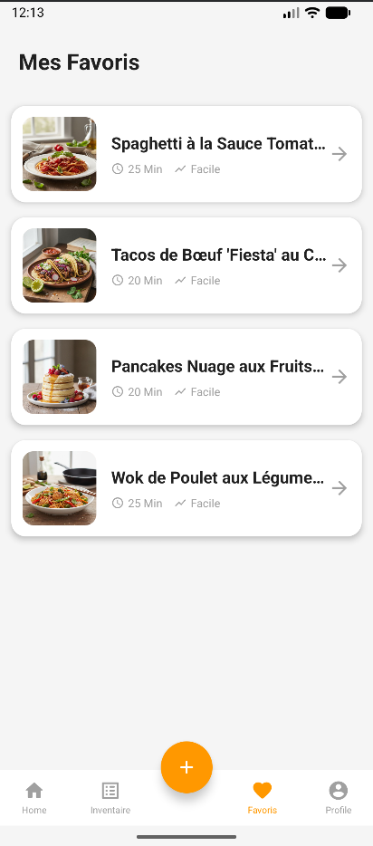
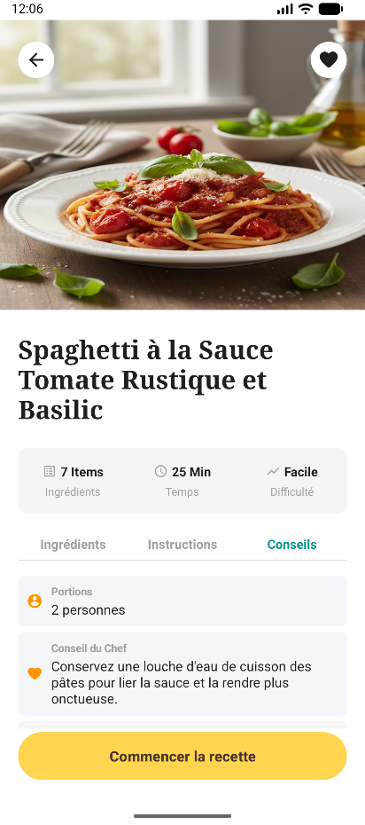
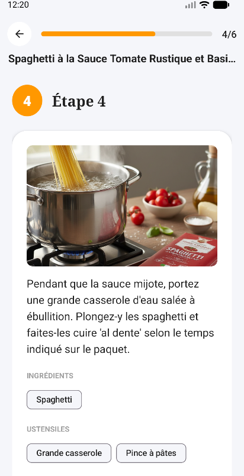

<p align="center">
  
</p>

<h1 align="center">IntelliCuisine: AI-Powered Smart Recipe Generator</h1>

<p align="center">
  
  
  
  
  
</p>

<p align="center">
  <strong>IntelliCuisine</strong> is a smart, native Android application that leverages Google Gemini AI to generate personalized recipes from your available ingredients. It features real-time Firebase synchronization and an interactive cooking assistant to guide you through every step.
</p>

---

## 📑 Table of Contents

| Section | Description |
|---------|-------------|
| [✨ About](#-about) | Project overview and goals |
| [🚀 Features](#-features) | Key capabilities of the app |
| [📸 Screenshots](#-screenshots) | Visual preview of the app |
| [⚙️ Getting Started](#️-getting-started) | Setup and installation guide |
| [📖 Usage](#-usage) | How to use the application |
| [🤝 Contributing](#-contributing) | Guidelines for contributors |
| [⚠️ Known Issues](#️-known-issues) | Current limitations |
| [📄 License](#-license) | Licensing information |
| [📬 Contact](#-contact) | Get in touch |

---

## ✨ About

**IntelliCuisine** is a smart, native Android app designed to inspire your culinary creativity. By leveraging **Google Gemini AI**, it provides personalized recipe suggestions based on ingredients you have on hand.

### 🎯 Key Highlights

| Feature | Description |
|---------|-------------|
| 🤖 **AI-Powered** | Utilizes Gemini AI for intelligent recipe generation |
| ☁️ **Cloud Sync** | Real-time synchronization with Firebase |
| 👨‍🍳 **Cooking Assistant** | Step-by-step guidance throughout the cooking process |
| 📱 **Native Android** | Built with Java for optimal performance |

---

## 🚀 Features

<table>
  <tr>
    <td align="center" width="33%">
      <br>
      <strong>AI Recipe Generation</strong><br>
      <sub>Get personalized recipes using Gemini AI based on your available ingredients</sub>
    </td>
    <td align="center" width="33%">
      <br>
      <strong>Ingredient Management</strong><br>
      <sub>Easily add, remove, and manage your pantry items with smart scanning</sub>
    </td>
    <td align="center" width="33%">
      <br>
      <strong>Firebase Sync</strong><br>
      <sub>Seamless cloud backup and real-time synchronization</sub>
    </td>
  </tr>
  <tr>
    <td align="center" width="33%">
      <br>
      <strong>Cooking Assistant</strong><br>
      <sub>Interactive step-by-step instructions with timers</sub>
    </td>
    <td align="center" width="33%">
      <br>
      <strong>Favorites</strong><br>
      <sub>Save your favorite recipes for quick access</sub>
    </td>
    <td align="center" width="33%">
      <br>
      <strong>User Profiles</strong><br>
      <sub>Personalized experience with saved preferences</sub>
    </td>
  </tr>
</table>

---

## 📸 Screenshots

<table>
  <tr>
    <td align="center">
      <br>
      <strong>Home Screen</strong><br>
      <sub>Generate recipes & view your inventory</sub>
    </td>
    <td align="center">
      <br>
      <strong>Favorites</strong><br>
      <sub>Quick access to saved recipes</sub>
    </td>
    <td align="center">
      <br>
      <strong>Recipe Details</strong><br>
      <sub>Ingredients, instructions & chef tips</sub>
    </td>
    <td align="center">
      <br>
      <strong>Cooking Mode</strong><br>
      <sub>Step-by-step guidance with AI images</sub>
    </td>
  </tr>
</table>

---

## ⚙️ Getting Started

### Prerequisites

| Requirement | Version | Notes |
|-------------|---------|-------|
| **Android Studio** | Hedgehog (2023.1.1) or newer | [Download here](https://developer.android.com/studio) |
| **JDK** | 17+ | Bundled with Android Studio |
| **Android SDK** | API 31 (Android 12) minimum | Target API 34 recommended |
| **Firebase Account** | — | [Create account](https://firebase.google.com/) |

---

### Step 1: Clone the Repository

```bash
git clone https://github.com/Khaledblel/intelli-cuisine.git
cd intelli-cuisine
```

---

### Step 2: Open in Android Studio

1. Launch **Android Studio**
2. Select **File** → **Open**
3. Navigate to the cloned `intelli-cuisine` folder and click **OK**
4. Wait for the project to load and Gradle sync to complete

> ⚠️ If prompted to update Gradle or plugins, click **Update** to ensure compatibility.

---

### Step 3: Firebase Configuration

#### 3.1 Create a Firebase Project

1. Go to [Firebase Console](https://console.firebase.google.com/)
2. Click **Add project** and follow the setup wizard
3. Disable Google Analytics (optional) and click **Create project**

#### 3.2 Register Your Android App

1. In your Firebase project, click **Add app** → **Android**
2. Enter the package name: `com.khaled.intellicuisine`
3. (Optional) Add a nickname and SHA-1 signing certificate
4. Click **Register app**

#### 3.3 Download Configuration File

1. Download the `google-services.json` file
2. Place it in the `app/` directory of your project:
   ```
   intelli-cuisine/
   └── app/
       └── google-services.json  ← Place here
   ```

#### 3.4 Enable Firebase Services

In the Firebase Console, enable the following:

| Service | Path | Configuration |
|---------|------|---------------|
| **Authentication** | Build → Authentication → Get started | Enable **Email/Password** provider |
| **Firestore Database** | Build → Firestore Database → Create database | Start in **test mode** for development |
| **Storage** | Build → Storage → Get started | Start in **test mode** for development |

#### 3.5 Firestore Security Rules (Development)

For development, use these permissive rules in **Firestore Database → Rules**:

```javascript
rules_version = '2';
service cloud.firestore {
  match /databases/{database}/documents {
    match /{document=**} {
      allow read, write: if request.auth != null;
    }
  }
}
```

#### 3.6 Storage Security Rules (Development)

In **Storage → Rules**:

```javascript
rules_version = '2';
service firebase.storage {
  match /b/{bucket}/o {
    match /{allPaths=**} {
      allow read, write: if request.auth != null;
    }
  }
}
```

---

### Step 4: Enable Firebase AI (Gemini)

1. In Firebase Console, go to **Build** → **AI**
2. Click **Get started** and enable the Gemini API
3. Select **Google AI** as the backend provider
4. The app uses `gemini-2.5-flash` and `gemini-2.5-flash-image` models

> 📝 **Note:** Firebase AI handles API key management automatically through `google-services.json`. No separate API key configuration is required.

---

### Step 5: Build and Run

1. Connect an Android device via USB (with USB debugging enabled) or start an emulator
2. In Android Studio, select your device from the dropdown
3. Click the **Run** button (▶️) or press `Shift + F10`

**Alternative: Build via command line**

```bash
# Debug build
./gradlew assembleDebug

# Install on connected device
./gradlew installDebug
```

---

### Troubleshooting

| Issue | Solution |
|-------|----------|
| Gradle sync fails | File → Invalidate Caches → Restart |
| `google-services.json` not found | Ensure file is in `app/` directory |
| Firebase connection error | Verify package name matches Firebase config |
| Emulator too slow | Use a physical device or enable hardware acceleration |
| Build tools missing | SDK Manager → Install required SDK platforms |

---

## 📖 Usage

### First Launch

1. **Create an Account**
   - Launch the app and tap **S'inscrire** (Register)
   - Enter your name, email, and password
   - Tap **S'inscrire** to create your account

2. **Welcome Screen**
   - After registration, you'll see a welcome screen
   - Tap **Commencer** (Get Started) to enter the app

---

### Managing Your Pantry

#### Adding Ingredients Manually

1. Navigate to the **Frigo** (Inventory) tab using the bottom navigation
2. Tap the **+** floating action button
3. Enter ingredient name and quantity
4. Tap **+ Ajouter une ligne** to add more ingredients (up to 5 at once)
5. Tap **Tout valider** to save

#### Adding Ingredients via Camera

1. In the Add Ingredient sheet, tap **Scanner**
2. Take a photo of your ingredients
3. The AI will automatically identify and populate the ingredient list
4. Review and edit as needed, then tap **Tout valider**

#### Editing/Deleting Ingredients

- **Edit:** Tap on any ingredient card to modify name or quantity
- **Delete:** Swipe left or tap the delete icon on an ingredient

---

### Generating Recipes

1. Go to the **Accueil** (Home) tab
2. Tap the **Générer une recette** (Generate Recipe) button
3. Wait while the AI creates a personalized recipe based on your pantry
4. View the complete recipe with:
   - **Ingrédients:** Required ingredients with quantities
   - **Instructions:** Step-by-step cooking directions
   - **Conseils:** Chef tips and serving suggestions

---

### Cooking Mode

1. Open any recipe (from Home or Favorites)
2. Tap **Commencer la recette** (Start Recipe)
3. Swipe through step-by-step instructions
4. For timed steps:
   - Tap **Démarrer** to start the timer
   - Tap **Pause** to pause
   - Timer continues even if you leave the app (notification will appear)
5. Tap **Étape suivante** or swipe to proceed
6. On the final step, tap **Terminer la recette** to complete

---

### Managing Favorites

- **Add to Favorites:** Tap the heart icon (♡) on any recipe
- **View Favorites:** Navigate to the **Favoris** tab
- **Remove from Favorites:** Tap the filled heart icon (♥) to remove

---

### Profile Settings

Access your profile from the **Profil** tab to:

| Action | Description |
|--------|-------------|
| **Edit Name** | Tap on your name to update it |
| **Change Email** | Update email (requires verification) |
| **Change Password** | Enter current and new password |
| **Delete Account** | Permanently delete your account and data |
| **Logout** | Sign out of your account |

---

## 🤝 Contributing

Please follow the guidelines below to ensure a smooth contribution process.

### Prerequisites

- Familiarity with Android development and Java
- Understanding of the project structure and Firebase integration

### Contribution Process

1. **Fork** the repository on GitHub
2. **Clone** your fork locally
3. **Create** a new branch for your feature or fix (`git checkout -b feature/your-feature-name`)
4. **Make** your changes following the existing code style
5. **Test** your changes thoroughly
6. **Commit** with clear, descriptive messages
7. **Push** to your fork
8. **Submit** a Pull Request with a detailed description

### Code Standards

- Follow existing naming conventions and code formatting
- Include comments for complex logic
- Ensure no build warnings or errors
- Update documentation if applicable

### Reporting Issues

- Use [GitHub Issues](https://github.com/Khaledblel/intelli-cuisine/issues) for bug reports and feature requests
- Provide detailed reproduction steps for bugs
- Check existing issues before creating duplicates

---

## ⚠️ Known Issues

| Status | Issue | Description |
|--------|-------|-------------|
| 🌙 | **No Dark Mode** | The app currently lacks dark mode support|
| 🌐 | **French Only** | Interface is in French; English localization is planned |
| 📶 | **Online Required** | Recipe generation and sync require internet connection |
| 🥗 | **Limited Dietary Options** | Advanced dietary preferences (vegan, gluten-free) are not fully supported |
| ♿ | **Accessibility** | Screen reader support and font scaling are minimal |

> 📢 Found another issue? [Report it here](https://github.com/Khaledblel/intelli-cuisine/issues/new)

---

## 📄 License

This project is licensed under the **MIT License**. See the [LICENSE](LICENSE) file for details.

---

## 📬 Contact

- **Author:** [Khaledblel](https://github.com/Khaledblel)
- **Issues:** [GitHub Issues](https://github.com/Khaledblel/intelli-cuisine/issues)

---

<p align="center">
  <a href="#-intellicuisine-ai-powered-smart-recipe-generator">⬆️ Back to Top</a>
</p>
